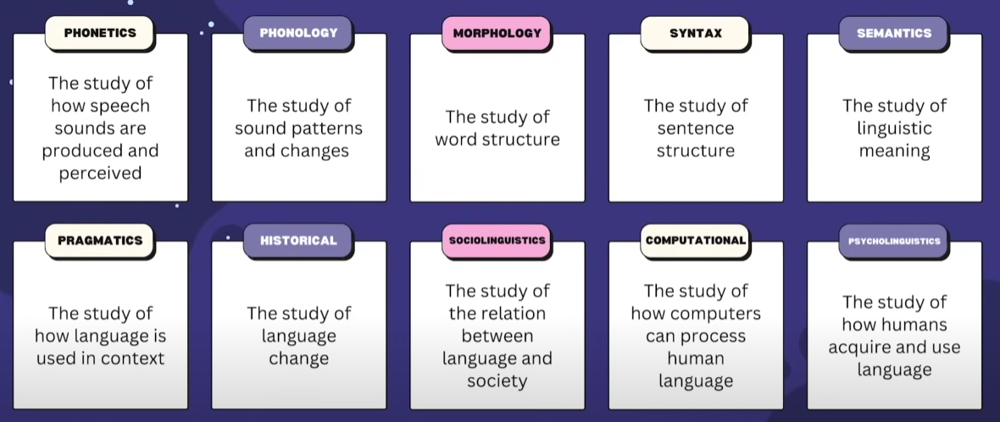

# INGENIERO PROMPT - Para inteligencias artificiales

### Ques es la Ingenieria rapida ?

Fortaleze , refina y mejora la interaccion y comunicacion entre una persona y la ia.
Biblioteca de avisos -- acumuklacion de datos
Ingeniero de avisos -- Persona que contral datos que va recibiendo la IA

Simulacion de intelgencia humana a traves de las maquinas --

Correlaciones -- Patrones -  para predecir resultados a traves de datos acumulados dedde antes -
Mas datos, la Ia mas preparada para dar respuestas --

### Linguistica

Tipos de lingusticas

Esta es la clave para poder impulsar la ingenieria - -
utilizar la gramatica decuada , ayuda a que las respuestas de la IA sean mas apropiada

Apegarse a la estandarizacion --

### MODELO DE LENGUAJE

Modelo que aprende de una gran coleccion de datos

Ejemplos como contestadores de voz ,o chatbots , son ditintos modelos de lenguaje.
Siempre recordar que los modelos de lenguajes depende de el humano para crearse y desarrollarse.

**Son la fusion del ingenio humano y el poder de los algoritmos.**

### ELIZA

Primer modelo de lenguaje

### Metalidade de la ingenieria prompt

"Personalmente, me gusta la analogia entre las indicaciones y el diseño de busquedas efectivas en Google. Es evidente que existen formas mejores y peores de escribir consultas en el motor de busqueda de Google que resuelven su tarea. Esta variacion existe debido a la opacidad de lo que Google esta haciendo bajo el capó"

- Mihal Eric

### GPT-4
- Uso de Tokens - API - Hilo de comunicacion y de ideo , en el mismo chat.

### BUENAS PRACTICAS

#### 45 Conceptos a tener en cuenta ala hora de construir buenos mensajes para darles a un modelo de lenguaje.

### 1. Usar instrucciones claras con detalles en la consulta. (no asumir que la IA sabe de lo que estamos hablando)

### 2 y 3. Considerar adoptar una persona y especificar el formato mediante indicaciones iterativas. (osea, si tenes una pregunta de varias partes, o si la primera respuesta no fue suficiente, continuar haciendo preguntas de seguimiento o pidiendo al modelo que explicar y que evitar, liberando la respuesta.)

### 4. Trate de no hacer que sis indicaciones sean tan contundentes que , sin darse cuenta, que le estemos diciendo al modelo que respuesta estamos esperando. Esto podria sesgar indebidamente la respuesta.

### 5. Limitar el alcance de los temas largos. Si preguntamos sobre un tema amplio, es util desglosarlo , o limitar el alcance para obtener una respuesta mas especifica.

**Ejemplo-1**
¿Cuando son las elecciones? (la ia no sabe que elecciones son y de que pais ?)
Siempre dar mas detalles en el mismo prompt (pensar bien el prompt)
¿Cuadno son las proximas elecciones presinedicales en Polonia?

Siempre dar detalles de que hace cada fragmento de codigo --
Tambien pedir a la IA por que hace cada paso --

Asi la IA buscara todas las maneras de no solo darnos la respuesta, si no tambien ayudarnos a comprender lo que nos da

**Ejemplo-2**

¿Que opinas sobre este articulo?
La IA nos responde casi lo mismo , pero al ser mas detallados
¿Que opinas sobre este articulo? Asegurate de que cada punto no tenga mas de 10 palabras, que el resumen o tu opinion sea sencilla y que no tenga en total + de 500 palabras.

